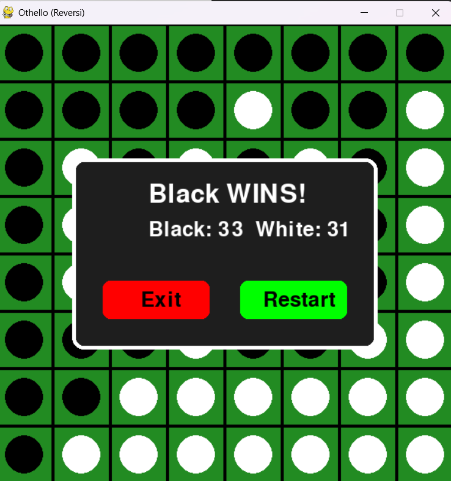

# Othello (Reversi) - Python & Pygame

A classic Othello (Reversi) game implemented in Python using the Pygame library, featuring an AI opponent using Minimax with Alpha-Beta Pruning.

## Features

- **Single-player mode**: Play against an AI opponent.
- **AI using Minimax Algorithm**: The AI determines the best possible move using minimax with alpha-beta pruning.
- **Valid move highlighting**: Ensures players can only place pieces in legal positions.
- **Game Over Screen**: Displays the winner and final scores.

## Installation

1. **Clone the repository**:
   ```sh
   git clone https://github.com/yourusername/othello-reversi.git
   cd othello-reversi
   ```
2. **Install dependencies**:
   ```sh
   pip install pygame
   ```

3. **Run the game**:
   ```sh
   python othello.py
   ```

## How to Play

- The game follows the standard **Othello rules**.
- Black plays first.
- Click on a valid position to place your piece.
- The game alternates turns between the **human player (White)** and the **AI (Black)**.
- The player with the most pieces at the end of the game wins.

## Screenshots



## Contributing

Feel free to fork the repository and submit pull requests. Improvements such as additional difficulty levels, a multiplayer mode, or UI enhancements are welcome!
